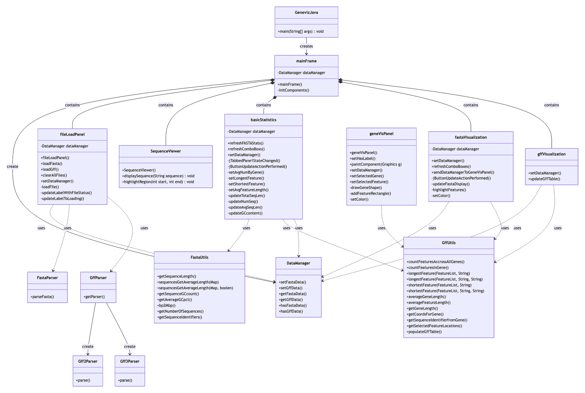
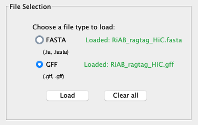
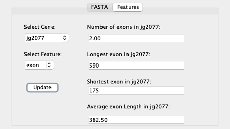
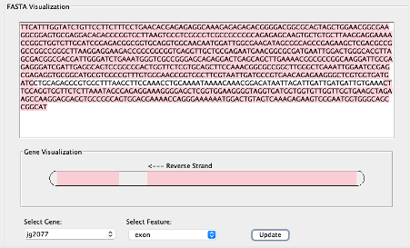
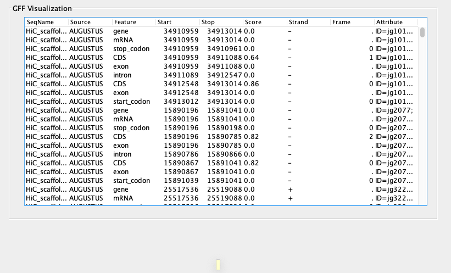

# geneviz-java

Geneviz-Java is a Java-based application for visualizing genomic data. It provides tools for loading, parsing, and displaying genomic sequences and annotations from various file formats such as FASTA and GFF.

## Features

- Load and parse FASTA files to visualize DNA sequences.
- Load and parse GFF files to visualize genomic features and annotations.
- Basic Statists on DNA Sequences and Features.
- FASTA Visualization Panel.
- GFF Visualization Table.

## Requirements

- Java 21 or higher

## Installation

<ol>
<li>Download the JAR file from <code>/geneviz-java/target/genevis-java*.jar</code>.
<li>Ensure you have Java 21 or higher installed on your system.
<li>Double-click the JAR file to run the application.
</ol>

## Program Structure

## File Selection

The file expects the user to load a FASTA file and a GFF3 file (Note: currently only GFF3 file support is available). The user may also load these files from the File menu bar.

## Basic Statistics

The basic statistics tab displays two options: FASTA and Features.

### FASTA

<ul>
<li>Displays the total length of the all the sequences in the FASTA file in megabases — Note: Support for filtering on individual sequences will be made available in a future release.</li>
<li>Displays the number of sequences in the FASTA file.</li>
<li>Displays the average sequence length in megabases of the FASTA file.</li>
<li>Displays the average GC count expressed as a percentage of the sequences in the FASTA file.</li>
</ul>

### Features

<ul>
<li>Default gene selection is “Select All”. This allows the user to interact with features in the file considering all genes. The user has the ability to select a specific gene — of type in a specific gene from the drop down box to explore further this gene. Click the update button to generate statistics on the user choice. </li>
<li>Displays the {average} number of genes per feature selected.</li>
<li>Displays the longest feature from the selected gene.</li>
<li>Displays the shortest feature from the selected gene.</li>
<li>Displays the average feature length from the selected gene.</li>
Per gene features include [mRNA, exon, intron, CDS]. </li>
</ul>

## FASTA VIsualization Panel

The FASTA Visualization tab allows the user to see the FASTA sequences at a selected gene location. In addition, the user can highlight features of interest with the feature dropdown box. Click the update button to calculate a new selection.

The gene visualization shows a visual representation of the gene model. In the current release the gene model will show left-to-right orientation with a label indicating the direction of the gene. Note: future release will automatically re-orientate the gene model based on strand direction.

## GFF Visualization Table

The GFF Visualization table shows a tabular view of the GFF file. Note: this table can take a while to load depending on the size of your input file. Max recommended size for this version is 66.7MB — support for faster parsing into data streams will be made available in future versions.

## Misc

<ul>
<li>File navigation bar allows the user to load a files outside of the file selection panel. Attempting to load multiple files is not recommended.</li> 
<li>File navigation: clear all files will do exactly what it says on the tin. It will also clear and redirect the user to the file selection panel.</li>
<li>Users can only navigate to the secondary tabs once data is loaded. </li>
<li>Note: The UX design leaves a little to be desired. The tabbed interface keeps the app simple and structured. The app would benefit from more flexible scaling approach. The current version does not scale if the user expands the interface. </li>
</ul>
